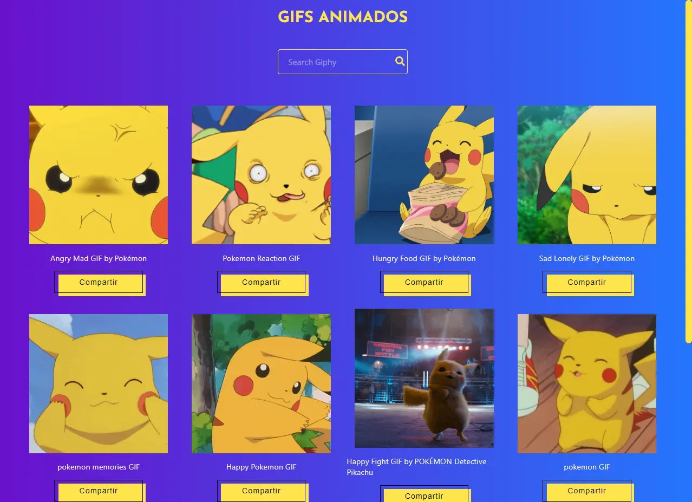

<h1 align="center">Gifs Animados 👇</h1>

🚀El proyecto de Gifs Animados se originó a partir del uso de la API de Giphy, al que se le agregó una función de búsqueda y compartir.  
La característica principal del proyecto es permitir que los usuarios compartan el archivo GIF animado en lugar del enlace, lo cual anteriormente no era una opción clara.
Esta funcionalidad permite visualizar y compartir fácilmente GIFs animados en WhatsApp y redes sociales.

 

### Autores ✒️

* **Luis Herdeth** - [Gifs Animados](https://luisherdeth2020.github.io/gifsAnimados)
